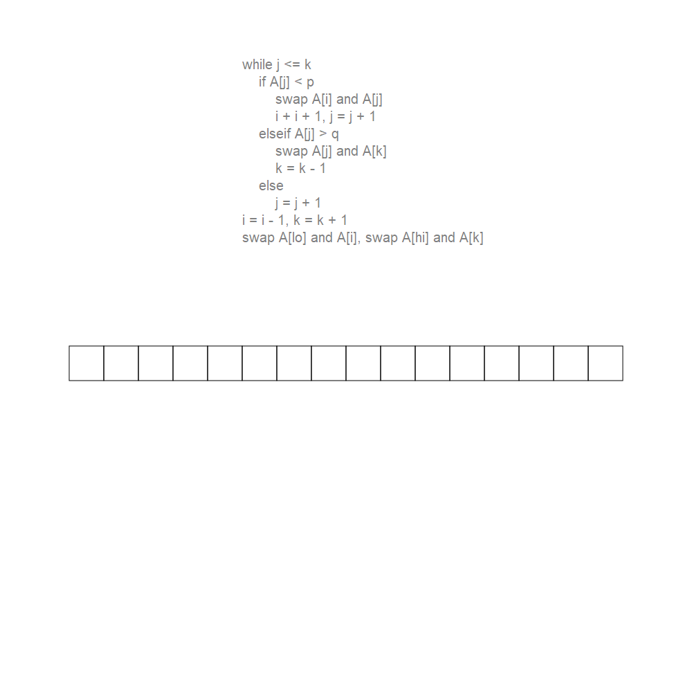
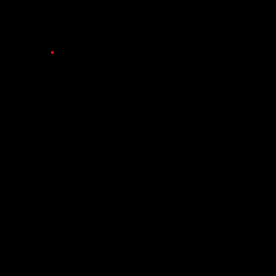
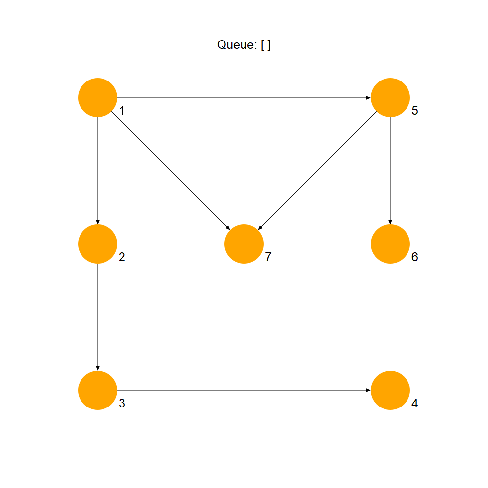
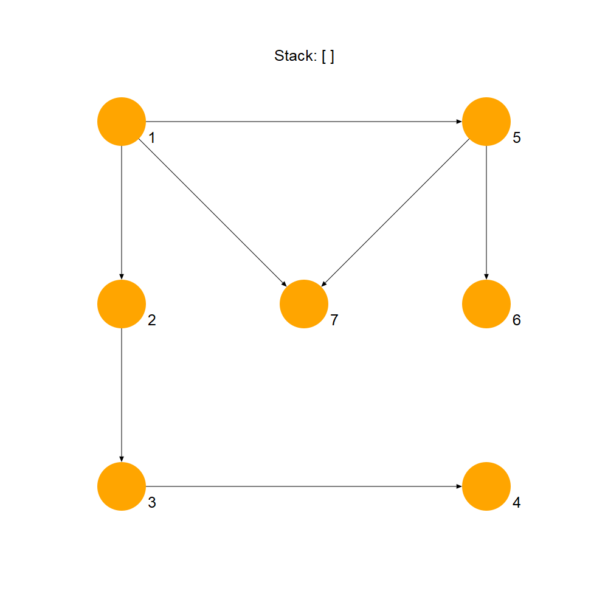
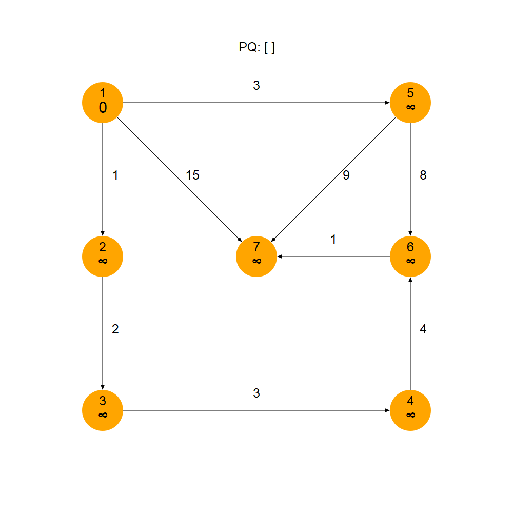
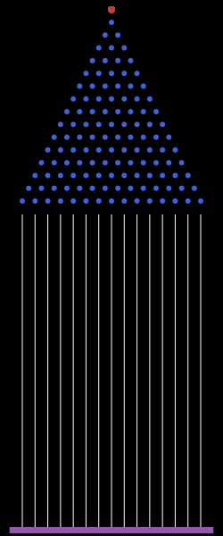

# Some examples of animations done in Javis

## Partition algorithms

| Animation | Source |
| --- | --- |
|  | [javis_lomuto.jl](partition/javis_lomuto.jl) |
|  | [javis_hoare.jl](partition/javis_hoare.jl) |
|  | [javis_3way.jl](partition/javis_3way.jl) |
|  | [javis_dualpivot.jl](partition/javis_dualpivot.jl) |

## Hilbert curve

Code to generate points for hilbert curve from [cormullion/hilbert-animation.jl](https://gist.github.com/cormullion/40cca8cc3ad7a315fe2f943dbe832797).

| Animation | Source |
| --- | --- |
|  | [hilbert.jl](hilbert/hilbert.jl) |

## Graph algortihms

| Animation | Source |
| --- | --- |
|  | [bfs_javis.jl](graphs/bfs_javis.jl) |
|  | [dfs_javis.jl](graphs/dfs_javis.jl) |
|  | [dijkstra_javis.jl](graphs/dijkstra_javis.jl) |

## Galton Board

Also found as an example in [Javis.jl](https://github.com/Wikunia/Javis.jl).

| Animation | Source |
| --- | --- |
|  | [galton.jl](galton/galton.jl) |
